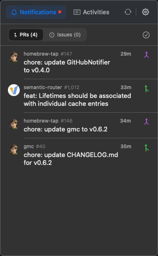
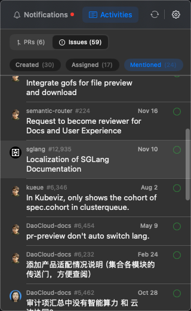

# GitHubNotifier
    

  
   
  

    
  

  
A lightweight macOS menubar hub for your GitHub works.

  

    
    
    
  

## Screenshots

  
  

## Design Principles

- Menubar is the single entry point and attention anchor
- 30-second rule: core flows should finish within half a minute
- Keep it lightweight: do triage here, deep work in GitHub
- Use-and-go: quick actions in a transient window, not a permanent workspace

## Current Capabilities

- Menubar-first workflow with configurable Notifications, Activities, and Search tabs
- GitHub OAuth device flow sign-in
- Unread GitHub notifications with issue/PR grouping, mark-as-read actions, and system notifications
- Activities view powered by GitHub Search for open issues/PRs you created, are assigned to, are mentioned in, or were requested to review
- Saved searches for issues, PRs, and repositories, with optional pinned searches in the menu bar
- Notification rules for matching repository, organization, notification type, or reason, with mark-as-read and suppress-notification actions
- Status cache and CI check summary in list items
- Auto-updates via Sparkle
- i18n support (EN / zh-Hans)

## Next Up

- Activity and search workflow refinements
- More rule actions and notification controls

## Requirements

- macOS 15+
