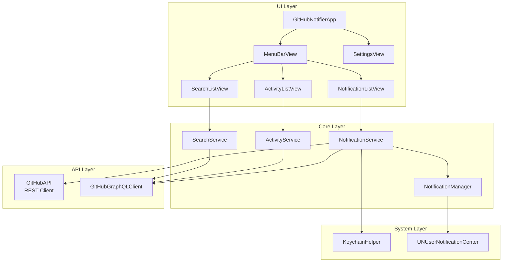
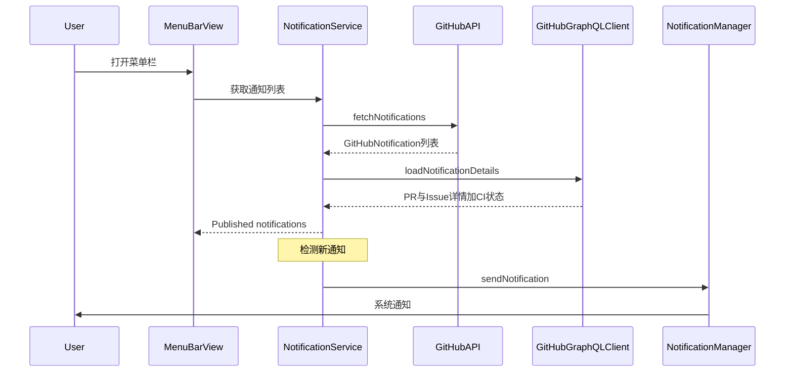

# 架构设计

```text
# Related Code
- Sources/GitHubNotifierCore/Services/
- Sources/GitHubNotifier/App/GitHubNotifierApp.swift
- Sources/GitHubNotifier/Utils/WindowManager.swift
```

## 设计理念

**为什么是这个形状？**

1. **菜单栏优先**: 用户需要快速查看通知，不需要全功能客户端。菜单栏弹出窗口是最佳入口。
2. **核心与 UI 分离**: `GitHubNotifierCore` 包含业务逻辑，无 UI 依赖；`GitHubNotifier` 是纯 UI 层。便于测试和复用。
3. **服务单例模式**: Services 作为 `@Observable` 单例注入到 SwiftUI 环境，全局共享状态。

## 组件图



## 数据流



## 分层职责

| 层 | 职责 | 关键决策 |
|---|------|---------|
| **UI Layer** | 渲染视图、处理用户交互 | 纯 SwiftUI，无业务逻辑 |
| **Core Layer** | 业务逻辑、状态管理 | `@Observable` 模式，自动驱动 UI |
| **API Layer** | 网络请求、数据解析 | REST + GraphQL 分离 |
| **System Layer** | 系统集成 (Keychain, 通知) | 封装 macOS API |

## 技术债务

| 问题 | 影响 | 建议 |
|------|------|------|
| 缓存无持久化 | 重启后丢失 PR/Issue 状态 | 可用 UserDefaults 或 SwiftData |
| 硬编码刷新间隔 | 无法根据用户偏好调整 | 已部分移至 Settings |
| 无离线模式 | 无网络时应用不可用 | 低优先级，目标用户始终在线 |
