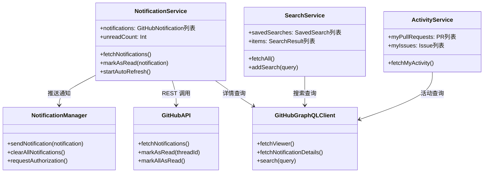

# 核心组件

```text
# Related Code
- Sources/GitHubNotifierCore/Services/
- Sources/GitHubNotifierCore/Models/
- Sources/GitHubNotifier/Utils/WindowManager.swift
```

## 组件字典

| 组件 | 文件 | 职责 |
|------|------|------|
| **GitHubAPI** | `Services/GitHubAPI.swift` | REST API 客户端，处理通知 CRUD |
| **GitHubGraphQLClient** | `Services/GitHubGraphQLClient.swift` | GraphQL 客户端，查询详情和搜索 |
| **NotificationService** | `Services/NotificationService.swift` | 通知业务逻辑，状态管理 |
| **NotificationManager** | `Services/NotificationManager.swift` | macOS 系统通知集成 |
| **ActivityService** | `Services/ActivityService.swift` | 用户活动 (PR/Issue) 管理 |
| **SearchService** | `Services/SearchService.swift` | 保存搜索和查询执行 |
| **RuleEngine** | `Services/RuleEngine.swift` | 通知过滤规则引擎 |
| **WindowManager** | `Utils/WindowManager.swift` | 多窗口状态管理 |

## 组件关系图



## 关键组件详解

### NotificationService

**核心职责**: 管理 GitHub 通知的完整生命周期

```swift
// Sources/GitHubNotifierCore/Services/NotificationService.swift:2-366

@Observable
class NotificationService {
    // 状态属性 - 自动驱动 UI 更新
    @Published var notifications: [GitHubNotification] = []
    @Published var unreadCount: Int = 0
    @Published var isLoading: Bool = false

    // 双客户端架构
    private var restClient: GitHubAPI?       // REST: 通知 CRUD
    private var graphqlClient: GitHubGraphQLClient?  // GraphQL: 详情

    // 缓存层 - 减少 API 调用
    private var prStateCache: [String: PRState] = [:]
    private var issueStateCache: [String: IssueState] = [:]
}
```

**设计决策**:
- 使用 REST API 获取通知列表 (GraphQL 不支持通知端点)
- 使用 GraphQL 批量获取 PR/Issue 详情，减少请求数
- 内存缓存避免重复请求同一资源

### GitHubGraphQLClient

**核心职责**: 封装 GitHub GraphQL API 调用

```swift
// Sources/GitHubNotifierCore/Services/GitHubGraphQLClient.swift

class GitHubGraphQLClient {
    // 核心方法
    func fetchViewer() async throws -> Viewer
    func fetchNotificationDetails(items:) async throws -> [String: NotificationDetails]
    func search(query:type:first:) async throws -> [SearchNode]
}
```

**设计决策**:
- 动态构建 GraphQL 查询，按需获取字段
- 使用 `AnyCodable` 处理任意 JSON 参数
- 统一错误处理 (`GraphQLError` 枚举)

### WindowManager

**核心职责**: 管理应用窗口状态

```swift
// Sources/GitHubNotifier/Utils/WindowManager.swift:11-35

@Observable
final class WindowManager {
    static let shared = WindowManager()
    @Published var activeWindow: WindowIdentifier?

    func open(_ identifier: WindowIdentifier)
    func close()
}
```

**设计决策**:
- 单例模式确保窗口状态全局一致
- `WindowIdentifier` 枚举约束可用窗口类型
- Observable 模式让 SwiftUI 自动响应窗口变化
