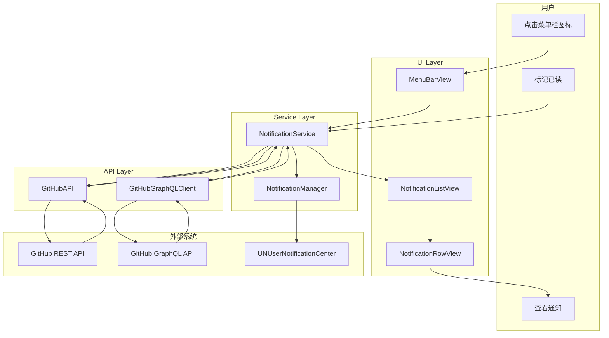
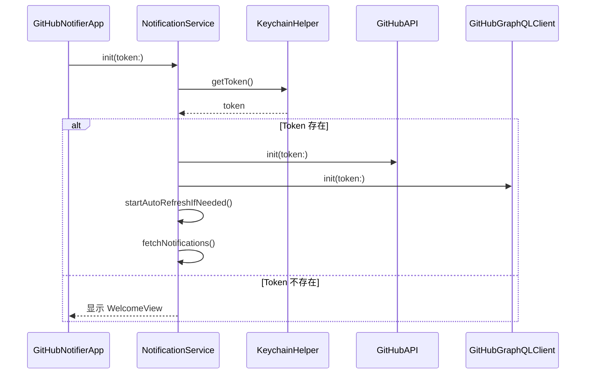
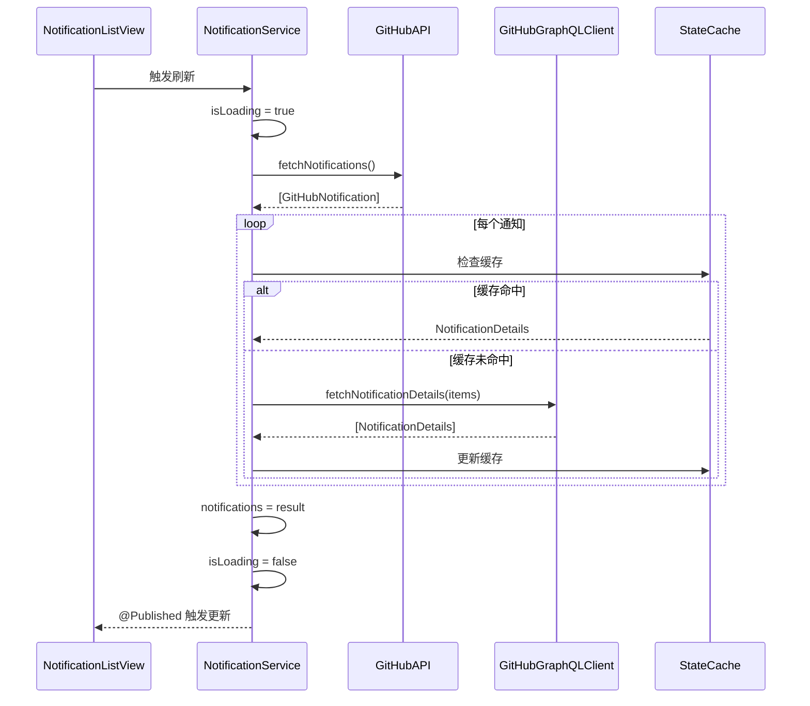
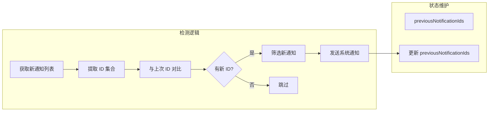
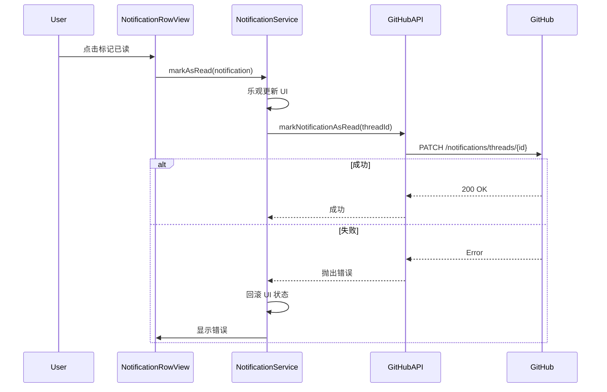
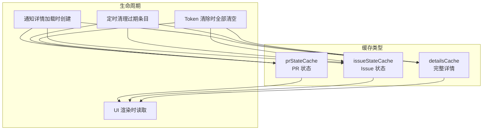
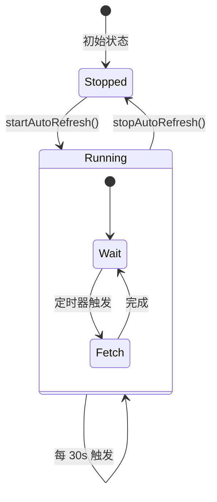

# 通知数据流

```text
# Related Code
- Sources/GitHubNotifierCore/Services/NotificationService.swift
- Sources/GitHubNotifierCore/Services/GitHubAPI.swift
- Sources/GitHubNotifierCore/Services/GitHubGraphQLClient.swift
- Sources/GitHubNotifierCore/Services/NotificationManager.swift
```

## 完整数据流



## 启动流程



## 通知获取流程



## 新通知检测



首次加载不触发系统通知，避免打开应用时通知轰炸。

## 标记已读流程



## 缓存策略



缓存 Key 格式: `{owner}/{repo}/{type}/{number}`

## 自动刷新



刷新间隔可在 Settings → General 中配置。
