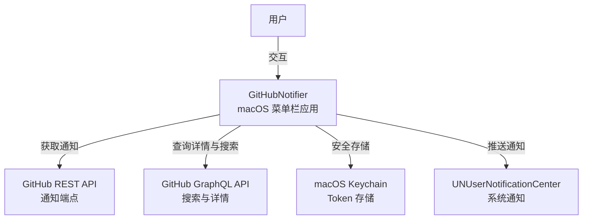

# 项目概览

```text
# Related Code
- Sources/GitHubNotifier/
- Sources/GitHubNotifierCore/
- Package.swift
```

## 一句话定义

GitHubNotifier 是一个 macOS 菜单栏应用，将 GitHub 通知、活动和搜索聚合到一个轻量级界面中。

## 技术栈

- **语言**: Swift 6.0 (Strict Concurrency)
- **UI 框架**: SwiftUI + MenuBarExtra
- **平台**: macOS 15+ (Sequoia)
- **包管理**: Swift Package Manager
- **依赖**:
  - Sparkle 2.8+ (自动更新)
  - Kingfisher 8.0+ (图片加载/缓存)
- **GitHub API**: REST (通知) + GraphQL (详情/搜索)
- **本地化**: 英文、简体中文

## 系统上下文



## 架构亮点

| # | 亮点 | 说明 |
|---|------|------|
| 1 | **双 API 客户端** | REST 用于通知 (GraphQL 不支持)，GraphQL 用于富数据查询。各司其职，不重叠。 |
| 2 | **状态缓存** | PR/Issue 状态缓存减少 API 调用，定时清理过期数据。 |
| 3 | **Observable 驱动** | `@Observable` + `@Published` 属性自动触发 UI 更新，无需手动刷新。 |

## 技术债务与风险

| # | 风险 | 说明 |
|---|------|------|
| 1 | **单一 Token** | 仅支持单账户登录，多账户场景需重新认证。 |
| 2 | **macOS 15 强依赖** | 使用 Swift 6 并发和最新 SwiftUI API，无法降级支持旧系统。 |
