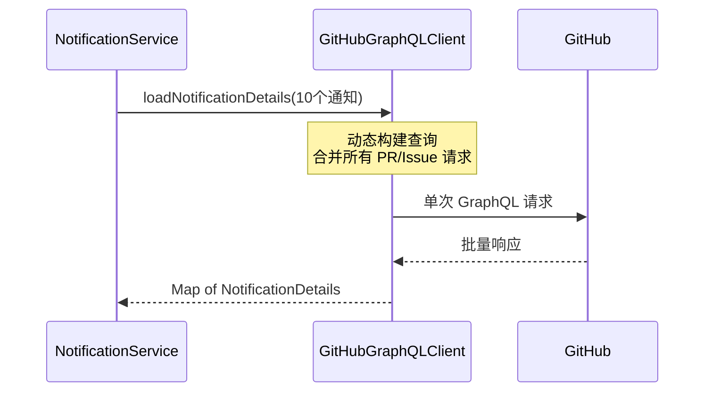
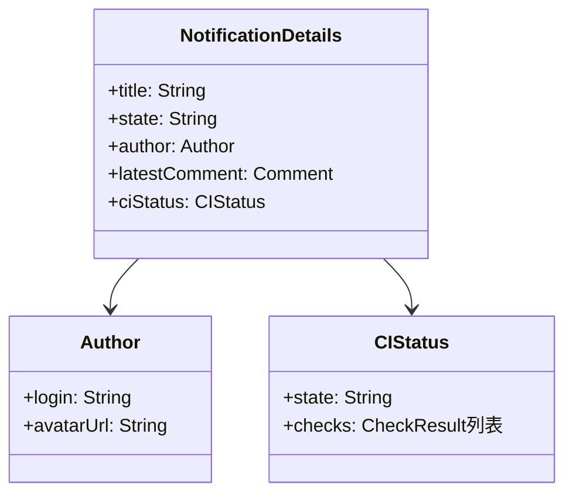

# API 客户端

```text
# Related Code
- Sources/GitHubNotifierCore/Services/GitHubAPI.swift
- Sources/GitHubNotifierCore/Services/GitHubGraphQLClient.swift
```

## 概述

GitHubNotifier 使用双客户端架构与 GitHub API 交互:

| 客户端 | 协议 | 用途 | 原因 |
|--------|------|------|------|
| `GitHubAPI` | REST | 通知 CRUD | GitHub GraphQL API 不支持通知端点 |
| `GitHubGraphQLClient` | GraphQL | PR/Issue 详情、搜索 | 单次请求获取多资源，减少网络开销 |

## GitHubAPI (REST)

```mermaid
graph LR
    subgraph GitHubAPI
        fetch[fetchNotifications]
        mark[markNotificationAsRead]
        markAll[markAllNotificationsAsRead]
    end

    fetch -->|GET| endpoint1[/notifications]
    mark -->|PATCH| endpoint2[/notifications/threads/id]
    markAll -->|PUT| endpoint3[/notifications]
```

### 核心方法

```swift
// Sources/GitHubNotifierCore/Services/GitHubAPI.swift:14-122

class GitHubAPI {
    // 获取所有未读通知
    func fetchNotifications() async throws -> [GitHubNotification]

    // 标记单条通知已读
    func markNotificationAsRead(threadId: String) async throws

    // 标记所有通知已读
    func markAllNotificationsAsRead() async throws
}
```

### 错误处理

```swift
enum APIError: Error {
    case invalidURL
    case invalidResponse
    case httpError(Int)
    case decodingError(Error)
}
```

## GitHubGraphQLClient

### 查询类型

| 查询 | 用途 | 响应模型 |
|------|------|----------|
| `viewer` | 获取当前用户信息 | `Viewer` |
| `repository.pullRequest` | 获取 PR 详情 | `NotificationDetails` |
| `repository.issue` | 获取 Issue 详情 | `NotificationDetails` |
| `search` | 跨仓库搜索 | `SearchNode` |

### 批量查询优化



GraphQL 批量查询示例:
```graphql
query {
  repo0: repository(owner: "owner1", name: "repo1") {
    pullRequest(number: 123) { ...prFields }
  }
  repo1: repository(owner: "owner2", name: "repo2") {
    issue(number: 456) { ...issueFields }
  }
}
```

### 响应模型层次



## 认证

两个客户端共享相同的认证机制:

```swift
// Token 从 Keychain 获取
let token = KeychainHelper.getToken()

// REST: Authorization header
request.setValue("token \(token)", forHTTPHeaderField: "Authorization")

// GraphQL: Bearer token
request.setValue("Bearer \(token)", forHTTPHeaderField: "Authorization")
```

## Rate Limiting

| API | 限制 | 策略 |
|-----|------|------|
| REST | 5000/hour | 轮询间隔 30s，实际消耗约 120/hour |
| GraphQL | 5000 points/hour | 批量查询减少积分消耗 |

建议: 启用状态缓存 (`prStateCache`, `issueStateCache`) 避免重复查询。
