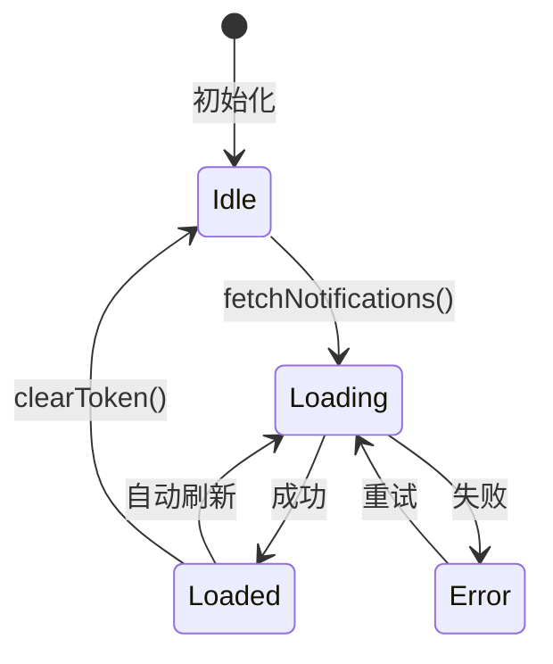
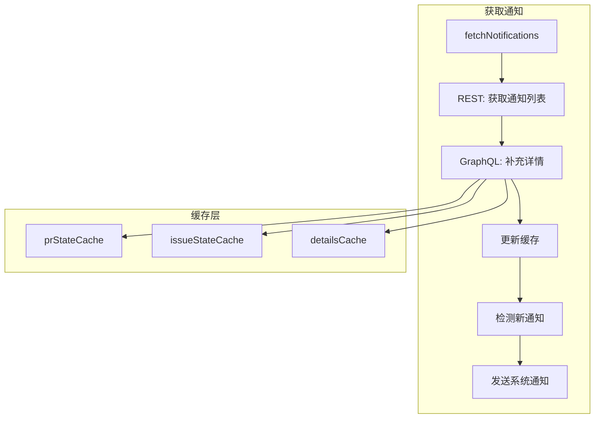
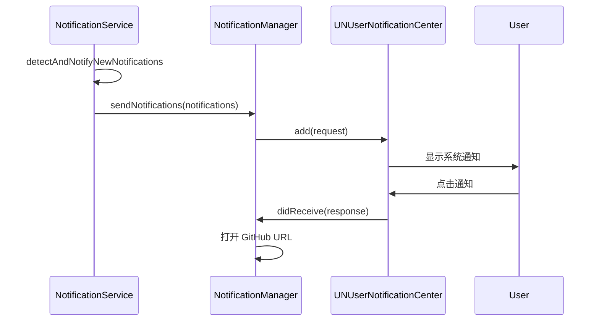

# NotificationService

```text
# Related Code
- Sources/GitHubNotifierCore/Services/NotificationService.swift
- Sources/GitHubNotifierCore/Services/NotificationManager.swift
```

## 职责

`NotificationService` 是通知功能的核心，负责:

1. 从 GitHub 获取通知列表
2. 使用 GraphQL 补充 PR/Issue 详情
3. 维护状态缓存减少 API 调用
4. 检测新通知并触发系统推送
5. 管理自动刷新定时器

## 状态模型



## 核心属性

```swift
@Observable
class NotificationService {
    // UI 绑定属性
    @Published var notifications: [GitHubNotification] = []
    @Published var unreadCount: Int = 0
    @Published var isLoading: Bool = false
    @Published var errorMessage: String?

    // 缓存
    private var prStateCache: [String: PRState] = [:]
    private var issueStateCache: [String: IssueState] = [:]
    private var detailsCache: [String: NotificationDetails] = [:]

    // 新通知检测
    private var previousNotificationIds: Set<String> = []
}
```

## 数据流



## 关键方法

### fetchNotifications

```swift
// NotificationService.swift:68-95

func fetchNotifications(isAutoRefresh: Bool = false) async {
    guard let restClient, let graphqlClient else { return }

    if !isAutoRefresh {
        isLoading = true
    }

    do {
        // 1. REST 获取通知列表
        let rawNotifications = try await restClient.fetchNotifications()

        // 2. GraphQL 补充详情
        await loadNotificationDetails()

        // 3. 检测新通知
        detectAndNotifyNewNotifications(rawNotifications)

        notifications = rawNotifications
        unreadCount = rawNotifications.filter { $0.unread }.count
    } catch {
        errorMessage = error.localizedDescription
    }

    isLoading = false
}
```

### loadNotificationDetails

```swift
// NotificationService.swift:106-161

private func loadNotificationDetails() async {
    // 过滤需要查询详情的通知
    let needsDetails = notifications.filter { n in
        detailsCache[cacheKey(for: n)] == nil
    }

    guard !needsDetails.isEmpty else { return }

    // 批量 GraphQL 查询
    let details = try await graphqlClient.fetchNotificationDetails(
        items: needsDetails
    )

    // 更新缓存
    for (key, detail) in details {
        detailsCache[key] = detail
        if let pr = detail.pullRequest {
            prStateCache[key] = determinePRState(pr)
        }
        if let issue = detail.issue {
            issueStateCache[key] = determineIssueState(issue)
        }
    }
}
```

### detectAndNotifyNewNotifications

```swift
// NotificationService.swift:267-314

private func detectAndNotifyNewNotifications(_ new: [GitHubNotification]) {
    let newIds = Set(new.map { $0.id })
    let addedIds = newIds.subtracting(previousNotificationIds)

    // 只在非首次加载时推送
    if !previousNotificationIds.isEmpty {
        let newNotifications = new.filter { addedIds.contains($0.id) }

        Task {
            await NotificationManager.shared.sendNotifications(
                for: newNotifications
            )
        }
    }

    previousNotificationIds = newIds
}
```

## 自动刷新

```swift
// NotificationService.swift:250-264

func startAutoRefresh(interval: TimeInterval = 30) {
    stopAutoRefresh()

    autoRefreshTask = Task {
        while !Task.isCancelled {
            try? await Task.sleep(for: .seconds(interval))
            await fetchNotifications(isAutoRefresh: true)
        }
    }
}
```

默认间隔 30 秒，用户可在 Settings 中调整。

## 与 NotificationManager 的关系



`NotificationManager` 是 `NotificationService` 的下游，专注于 macOS 系统通知集成。
