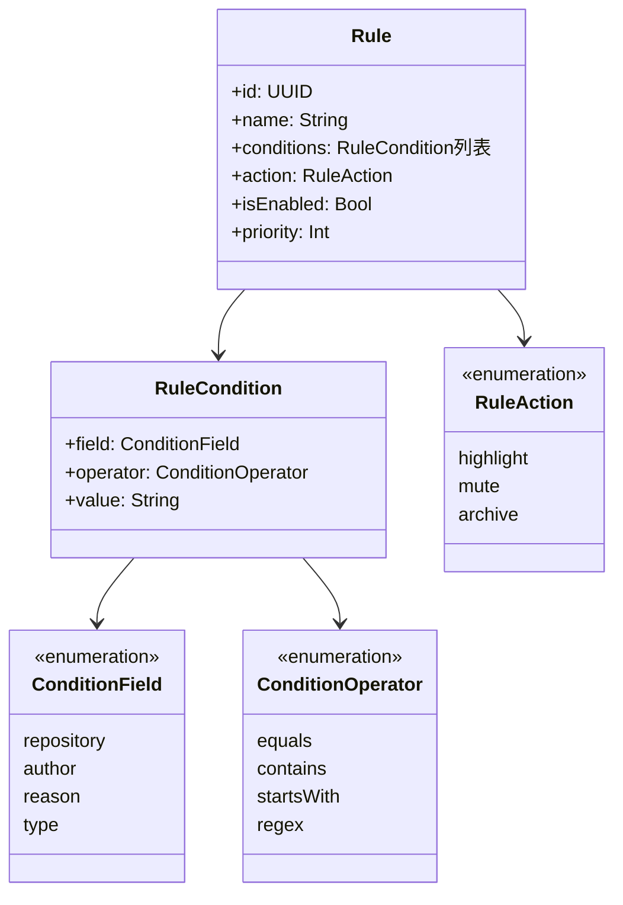
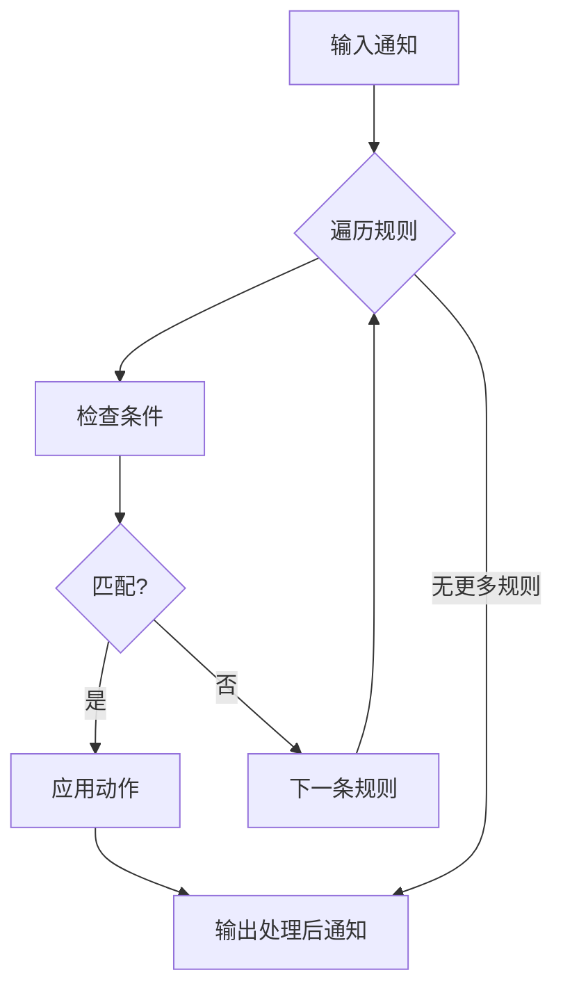
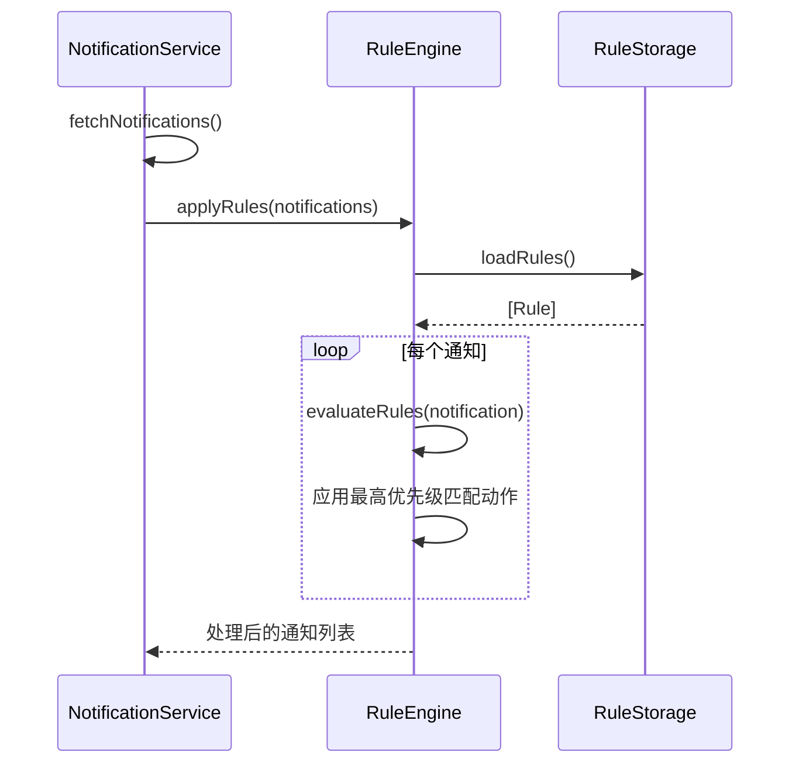

# RuleEngine

```text
# Related Code
- Sources/GitHubNotifierCore/Services/RuleEngine.swift
- Sources/GitHubNotifierCore/Services/RuleStorage.swift
- Sources/GitHubNotifierCore/Models/Rule.swift
```

## 概述

RuleEngine 实现基于规则的通知过滤，让用户自定义哪些通知需要关注。

## 设计理念

**为什么需要规则引擎？**

1. GitHub 通知量大，需要智能过滤
2. 不同仓库/用户有不同优先级
3. 区分核心维护者和普通贡献者

## 规则模型



## 规则示例

### 高亮核心仓库通知

```json
{
  "name": "核心仓库",
  "conditions": [
    {
      "field": "repository",
      "operator": "equals",
      "value": "myorg/core-repo"
    }
  ],
  "action": "highlight",
  "isEnabled": true,
  "priority": 100
}
```

### 静音 bot 通知

```json
{
  "name": "Bot 通知",
  "conditions": [
    {
      "field": "author",
      "operator": "contains",
      "value": "bot"
    }
  ],
  "action": "mute",
  "isEnabled": true,
  "priority": 50
}
```

## 规则执行流程



## 条件匹配

```swift
func matches(_ notification: GitHubNotification, condition: RuleCondition) -> Bool {
    let fieldValue = getValue(notification, for: condition.field)

    switch condition.operator {
    case .equals:
        return fieldValue == condition.value
    case .contains:
        return fieldValue.contains(condition.value)
    case .startsWith:
        return fieldValue.hasPrefix(condition.value)
    case .regex:
        return fieldValue.range(
            of: condition.value,
            options: .regularExpression
        ) != nil
    }
}
```

## RuleStorage

规则持久化到 UserDefaults:

```swift
class RuleStorage {
    private let storageKey = "NotificationRules"

    func loadRules() -> [Rule]
    func saveRules(_ rules: [Rule])
    func addRule(_ rule: Rule)
    func updateRule(_ rule: Rule)
    func deleteRule(id: UUID)
}
```

## 与 NotificationService 集成



## UI 配置

规则在 Settings → Rules 标签页配置:

```
┌─────────────────────────────────────┐
│ Rules                               │
├─────────────────────────────────────┤
│ ✓ 核心仓库        [highlight] [Edit]│
│ ✓ Bot 通知        [mute]      [Edit]│
│ ○ Dependabot     [archive]   [Edit]│
│                                     │
│ [+ Add Rule]                        │
└─────────────────────────────────────┘
```

## 参考文档

详细的规则语法和示例请参考: `docs/rules_usage.md`
