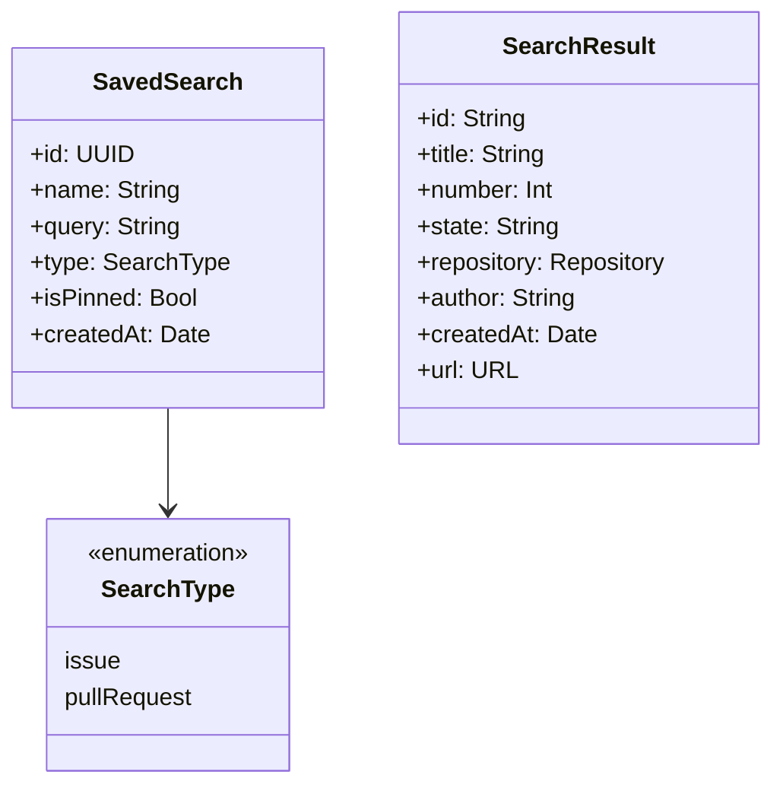
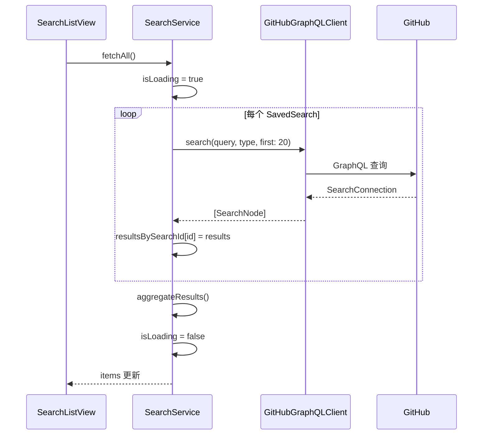

# SearchService

```text
# Related Code
- Sources/GitHubNotifierCore/Services/SearchService.swift
- Sources/GitHubNotifierCore/Models/SavedSearch.swift
- Sources/GitHubNotifierCore/Models/SearchResult.swift
```

## 职责

`SearchService` 实现保存搜索功能:

1. 管理用户保存的搜索条件
2. 通过 GraphQL Search API 执行查询
3. 聚合多个搜索的结果
4. 持久化保存搜索到 UserDefaults

## 数据模型



## 状态管理

```swift
@Observable
class SearchService {
    // UI 绑定
    @Published var savedSearches: [SavedSearch] = []
    @Published var items: [SearchResult] = []
    @Published var isLoading: Bool = false
    @Published var errorMessage: String?

    // 按搜索 ID 分组的结果
    @Published var resultsBySearchId: [UUID: [SearchResult]] = [:]
}
```

## 查询执行流程



## GraphQL 搜索查询

```graphql
query SearchQuery($query: String!, $type: SearchType!, $first: Int!) {
  search(query: $query, type: $type, first: $first) {
    nodes {
      ... on Issue {
        id
        title
        number
        state
        repository { nameWithOwner }
        author { login }
        createdAt
        url
      }
      ... on PullRequest {
        id
        title
        number
        state
        repository { nameWithOwner }
        author { login }
        createdAt
        url
      }
    }
  }
}
```

## CRUD 操作

### 添加搜索

```swift
func addSearch(
    name: String,
    query: String,
    type: SearchType,
    isPinned: Bool = false
) {
    let search = SavedSearch(
        id: UUID(),
        name: name,
        query: query,
        type: type,
        isPinned: isPinned,
        createdAt: Date()
    )
    savedSearches.append(search)
    saveToStorage()
}
```

### 更新搜索

```swift
struct UpdateOptions {
    var name: String?
    var query: String?
    var type: SearchType?
    var isPinned: Bool?
}

func updateSearch(id: UUID, options: UpdateOptions) {
    guard let index = savedSearches.firstIndex(where: { $0.id == id }) else {
        return
    }
    if let name = options.name { savedSearches[index].name = name }
    if let query = options.query { savedSearches[index].query = query }
    // ...
    saveToStorage()
}
```

### 删除搜索

```swift
func deleteSearch(id: UUID) {
    savedSearches.removeAll { $0.id == id }
    resultsBySearchId.removeValue(forKey: id)
    saveToStorage()
    aggregateResults()
}
```

## 持久化

搜索条件存储在 UserDefaults:

```swift
private let storageKey = "SavedSearches"

private func saveToStorage() {
    let data = try? JSONEncoder().encode(savedSearches)
    UserDefaults.standard.set(data, forKey: storageKey)
}

private func loadFromStorage() {
    guard let data = UserDefaults.standard.data(forKey: storageKey),
          let searches = try? JSONDecoder().decode([SavedSearch].self, from: data)
    else { return }
    savedSearches = searches
}
```

## 结果聚合

`aggregateResults()` 将所有搜索结果合并并去重:

```swift
private func aggregateResults() {
    var seen = Set<String>()
    var all: [SearchResult] = []

    for search in savedSearches {
        guard let results = resultsBySearchId[search.id] else { continue }
        for result in results {
            if !seen.contains(result.id) {
                seen.insert(result.id)
                all.append(result)
            }
        }
    }

    items = all.sorted { $0.createdAt > $1.createdAt }
}
```
