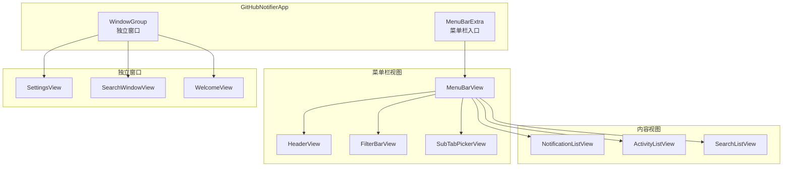
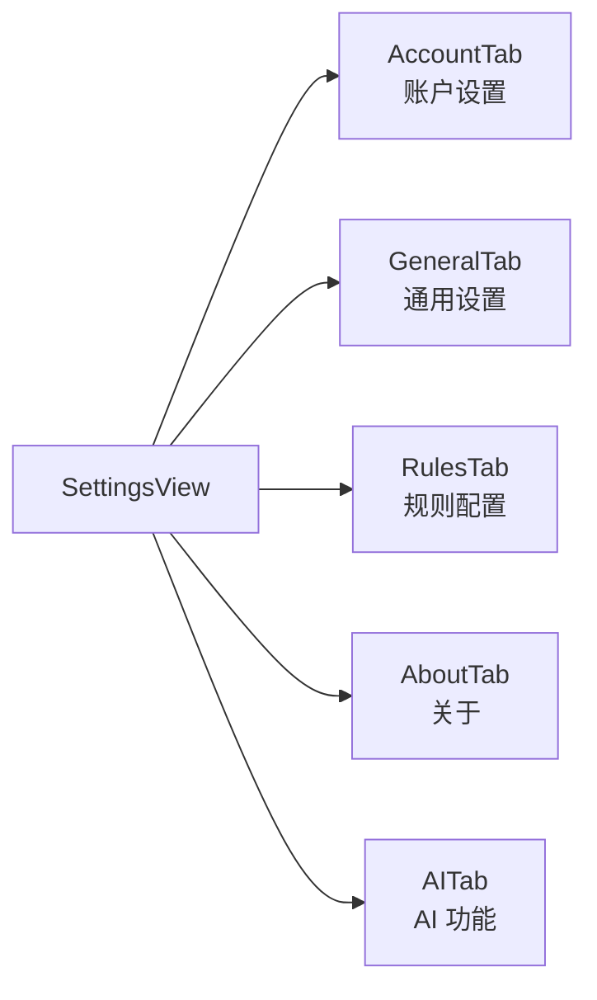

# 视图层概览

```text
# Related Code
- Sources/GitHubNotifier/Views/
- Sources/GitHubNotifier/App/GitHubNotifierApp.swift
```

## 视图层次结构



## 视图职责

| 视图 | 文件 | 职责 |
|------|------|------|
| `MenuBarView` | `Views/MenuBarView.swift` | 菜单栏弹出窗口主容器 |
| `HeaderView` | `Views/MenuBar/HeaderView.swift` | 顶部导航和用户信息 |
| `FilterBarView` | `Views/MenuBar/FilterBarView.swift` | 通知过滤条件 |
| `NotificationListView` | `Views/Notifications/NotificationListView.swift` | 通知列表 |
| `NotificationRowView` | `Views/Notifications/NotificationRowView.swift` | 单条通知行 |
| `ActivityListView` | `Views/Activity/ActivityListView.swift` | 活动列表 |
| `SearchListView` | `Views/Search/SearchListView.swift` | 搜索结果列表 |
| `SettingsView` | `Views/SettingsView.swift` | 设置页面容器 |

## MenuBarExtra 入口

```swift
// GitHubNotifierApp.swift:68-105

var body: some Scene {
    MenuBarExtra {
        MenuBarView()
            .environment(notificationService)
            .environment(activityService)
            .environment(searchService)
    } label: {
        MenuBarLabel(unreadCount: notificationService.unreadCount)
    }
    .menuBarExtraStyle(.window)

    WindowGroup(for: WindowIdentifier.self) { $id in
        WindowView(identifier: id)
            .environment(notificationService)
            // ...
    }
}
```

## 组件库

### 通用组件

| 组件 | 文件 | 用途 |
|------|------|------|
| `AvatarView` | `Components/AvatarView.swift` | 用户头像 (Kingfisher 加载) |
| `StateIcon` | `Components/StateIcon.swift` | PR/Issue 状态图标 |
| `CIStatusBadge` | `Components/CIStatusBadge.swift` | CI 状态徽章 |
| `TimeAgoText` | `Components/TimeAgoText.swift` | 相对时间显示 |
| `TabButton` | `Components/TabButton.swift` | 标签页按钮 |

### 状态图标映射

```swift
// StateIcon.swift

enum StateIcon {
    static func icon(for state: PRState) -> String {
        switch state {
        case .open: return "PullRequestOpen"
        case .merged: return "PullRequestMerged"
        case .closed: return "PullRequestClosed"
        case .draft: return "PullRequestDraft"
        }
    }
}
```

## 数据绑定模式

视图通过 SwiftUI Environment 获取 Services:

```swift
struct NotificationListView: View {
    @Environment(NotificationService.self) var service

    var body: some View {
        List(service.notifications) { notification in
            NotificationRowView(notification: notification)
        }
    }
}
```

Services 的 `@Published` 属性变化自动触发视图更新。

## 设置页面结构



每个 Tab 是独立的 SwiftUI View，通过 `TabView` 组织。
