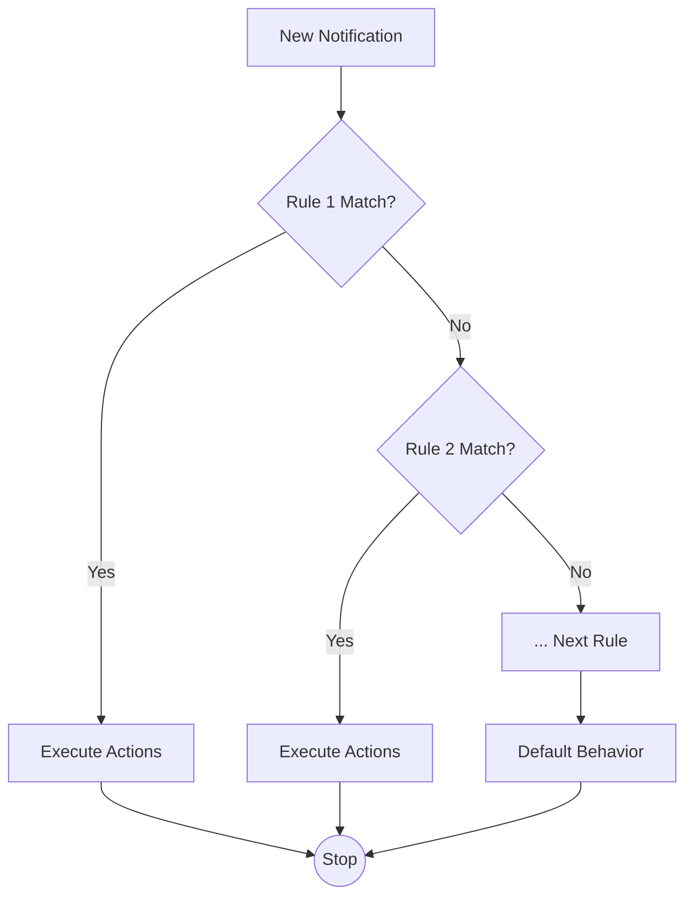

# GitHubNotifier Rules Engine Guide

The **Rules Engine** is a powerful feature in GitHubNotifier designed to help you automatically filter, categorize, and manage your GitHub notifications. By defining custom rules, you can ensure critical notifications stand out while automatically handling distractions.

## Accessing Rules Settings

1. Open **Settings**.
2. Click on the **Rules** tab at the top.
3. You will see the rules list, where you can add, edit, toggle, or delete rules.

## Creating a New Rule

1. Click the **+ Add Rule** button at the top right, or the **+** button in the empty state.
2. Configure the rule details in the editor that appears.

### Rule Configuration

A rule consists of the following components:

#### 1. Basic Info
- **Rule Name**: Give it a recognizable name (e.g., "Auto-read CI").
- **Enabled**: Whether the rule is active immediately after saving.

#### 2. Conditions
You can add one or more conditions to filter notifications. Each condition consists of a `Field`, `Operator`, and `Value`.

**Supported Fields:**
- **Repository**: Repository name, usually `owner/repo`. (Supports wildcard `*`)
    - Example: `monitor/backend`
- **Organization**: Organization name. (Supports wildcard `*`)
    - Example: `google`, `facebook`
- **Type**: Notification type.
    - Values: `PullRequest`, `Issue`, `Release`, `Commit`, `Discussion`, etc.
- **Reason**: The reason you received the notification.
    - Values: `Assigned`, `Mentioned`, `Review Requested`, `CI Activity`, etc.

**Operators:**
- **equals**: Exact match.
- **does not equal**: Exclude specific values.
- **matches**: Pattern match (Only for Repository and Organization, supports `*` wildcard).

**Logic:**
When using multiple conditions, choose how they combine:
- **AND**: All conditions must be true (e.g., CI notification **AND** from a specific repo).
- **OR**: Any condition can be true (e.g., CI notification **OR** Bot comment).

#### 3. Actions
When a notification matches the rule, the selected actions are executed.

- **Mark as Read**: Automatically marks the notification as read (it won't appear in the unread list).
- **Suppress System Notification**: Prevents the macOS system push notification, but the item remains unread in the app.

---

## Evaluation Flow

The Rules Engine evaluates notifications sequentially based on the order in the list (Priority).

---

## Examples

### Example 1: Reduce CI Noise

CI/CD status updates are frequent. Create a rule to auto-read them if you don't need immediate alerts.

- **Name**: Auto-read CI
- **Condition**: 
  - `Reason` **equals** `CI Activity`
- **Action**: 
  - `Mark as Read`

### Example 2: Silence Organization Notifications

If you follow an organization (e.g., `swiftlang`) but don't want system popups for every activity:

- **Name**: Silent Swift
- **Condition**: 
  - `Organization` **equals** `swiftlang`
- **Action**: 
  - `Suppress System Notification`

### Example 3: Focus on Core Repos (Wildcard)

If you only care about PRs from `my-company/backend` and `my-company/ios`, you can auto-read others.
*(Note: Since rules are "match and execute", you might set up an exclusion rule or use wildcards depending on strategy)*

- **Name**: Ignore non-core repos
- **Condition**:
  - `Repository` **does not equal** `my-company/*`
- **Action**:
  - `Mark as Read`

---

## Priority & FAQ

**Priority Management**
- Rules at the **top** have higher priority.
- Processing **stops** at the first matching rule.
- Drag and drop rules in the list to reorder them.

**FAQ**

**Q: Do rules apply to existing notifications?**
A: No. Rules are applied only when **new** notifications are fetched or refreshed.

**Q: I set "Mark as Read", but I still see a red dot?**
A: Auto-read notifications are removed from the unread count effectively. If you see a count, ensure the rule matched correctly or manually refresh.
